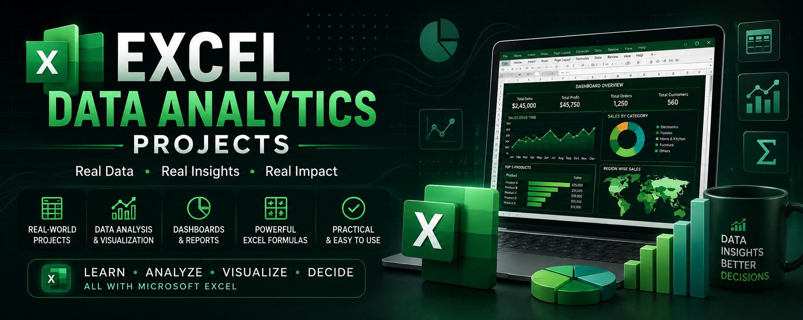
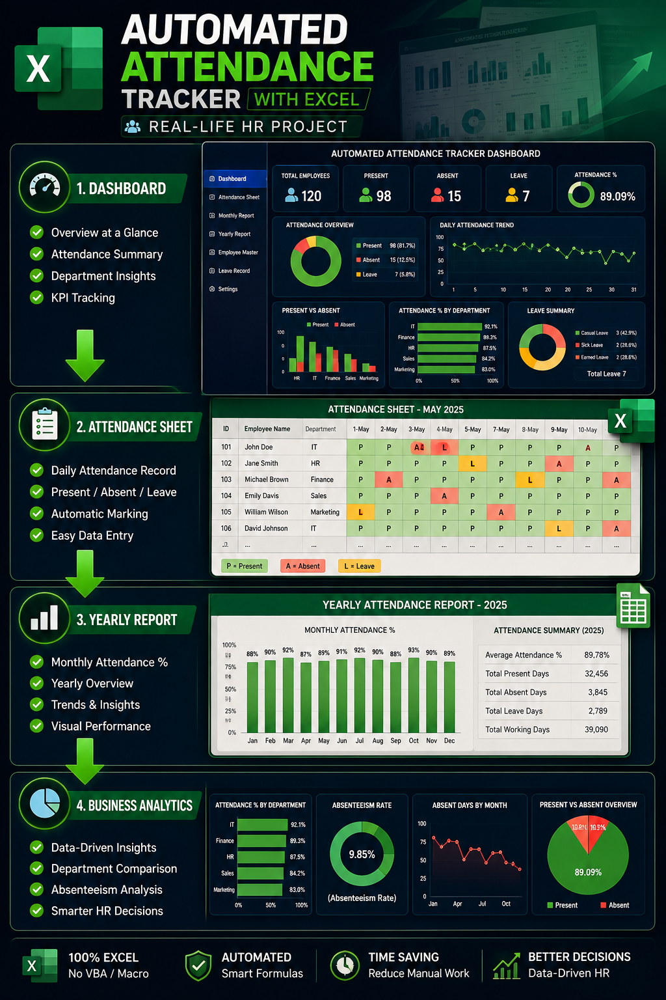

# 📊 Excel Data Analytics Projects



A collection of real-world Microsoft Excel projects built for Data Analytics, HR Reporting, Business Automation, Dashboard Development and KPI Reporting.

---

# 🚀 Featured Project

## 📌 Automated Attendance Tracker Dashboard

A complete Microsoft Excel solution for managing employee attendance and generating yearly reports.

### Features

✅ Employee Attendance Tracking

✅ Monthly Attendance Sheets

✅ Yearly Report Generation

✅ Business Reporting

✅ HR Dashboard

✅ Excel Automation

---

## Skills Used

- Microsoft Excel
- Conditional Formatting
- Data Validation
- Lookup Functions
- Dashboard Design
- Business Reporting

---

## Project Structure

```

Project-01-Automated-Attendance-Tracker/

```

---

## Preview



---

## Connect

GitHub - https://github.com/naskarsuvam21/

LinkedIn - www.linkedin.com/in/suvam-naskar

YouTube - www.youtube.com/@snexplanation

Portfolio - https://www.youtube.com/@snexplanation

---

⭐ Star this repository if you like it.
